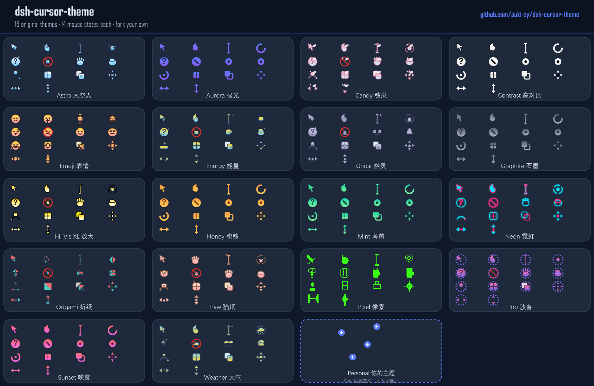

# dsh-cursor-theme

> 🖱️ Per-state mouse cursor customization for DeepSeek Harness — give every UI state (default, pointer, text, wait, not-allowed, …) its own PNG/CUR cursor, applied live and persisted across restarts.

[中文文档](README.zh.md) · [Requirements](docs/requirements.md) · [Feasibility](docs/feasibility.md) · Published on [npm](https://www.npmjs.com/package/dsh-cursor-theme) · Listed on [DSH 1024Store](https://github.com/imsai-sh/awesome-deepseek-harness-plugins/blob/main/catalog/plugins/auki-zy--dsh-cursor-theme.json) · Listed on [dshfind](https://dshfind.com) · [Release SOP](docs/PUBLISHING.md)

---

<p align="center">
  
</p>

> Every cell above shows all **14 mouse states** of one theme. The last cell (dashed border + **Personal** badge) is a personal theme — fork the repo, add your own pack, and it joins the lineup with its own style.

---

## ✨ Features

- 🎯 **Per-UI-state overrides** — 14 mouse states (default, pointer, text, wait, help, not-allowed, grab, grabbing, progress, cell, copy, move, resize-ew, resize-ns), each with its own image, hotspot and size
- 🎨 **18 original preset themes** — every theme covers **all 14 states** with baked PNGs:
  - 6 color palettes: Aurora, Honey, Mint, Sunset, Graphite, High Contrast
  - 12 creative themes: **Paw 🐾 · Energy ⚡ · Neon 🌃 · Emoji 😀 · Pixel 👾 · Weather ⛅ · Origami 📐 · Astro 🧑🚀 · Candy 🍬 · Ghost 👻 · Hi-Vis XL 🔍 (48px) · Pop 🎈**
  - One click to apply; every theme is also downloadable as a ZIP image pack
- 🖼️ **Built-in SVG template library** (25 hand-drawn shapes) + upload your own PNG/CUR (≤128×128, ≤5 MB validated)
- 📦 **Image pack import/export** — one ZIP (a PNG per state + `manifest.json`), inspect/edit/share real image files, or generate with an AI
- 🪟 **Apply to system (Windows)** — one click writes the theme into the OS cursor scheme (registry + `SPI_SETCURSORS`), visible in Explorer and every app; macOS: experimental Swift overlay + Accessibility guidance
- 📍 **Hotspot editor** (X/Y) for pixel-accurate clicks · 🔍 size steps 16/24/32/48
- 👁️ Per-row finished-cursor preview (right) + system-default icon (left) so you always know what you are replacing
- ♿ **Accessibility** — every rule carries a fallback keyword; failed images degrade to the system cursor, never `none`
- 💾 Persisted to the profile (dsh-settings), survives restarts
- 🌐 Bilingual (locale-driven zh/en)

## 📦 Install

```sh
# DSH Desktop (the GUI runs the `desktop` profile) — also installable from the Community Market (1024Store)
dsh plugin --profile desktop add dsh-cursor-theme

# Plain dsh web / browser (optional)
dsh plugin --profile web add dsh-cursor-theme
```

Restart DSH Desktop (or reload `dsh web`), then open **Settings → Cursor Theme**.

## 🎯 Usage

| Action | How |
|---|---|
| Apply a preset theme | Settings → Cursor Theme → click a theme pill |
| Download a theme as ZIP | Click the download icon next to a theme |
| Customize one state | Edit next to a state row → upload PNG/CUR or pick a built-in shape → set hotspot/size |
| Import a ZIP pack | Image pack → Import (e.g. a pack generated by an AI) |
| Apply to the whole OS (Windows) | Apply to system → one click |
| Reset everything | Restore system default |

## 🎨 Personal Theme — fork your own

The cell with the **Personal** badge (dashed border, listed last) is *your* theme — the bundled `cat-sitiao` is an example. Two ways to make your theme permanent:

**Option A — ZIP pack (no code)**
1. In DSH: Settings → Cursor Theme → **Import** any ZIP image pack (PNGs + `manifest.json` — export one of the built-ins as a starting template, or generate one with the included AI prompt)
2. Keep the ZIP in your own notes / repo to re-import anywhere

**Option B — Fork the repo (recommended for contributors)**
1. **Fork** this repository (a fork is your own copy — you manage it independently)
2. In `scripts/theme-art.mjs` add your theme entry (copy an existing one, change the palette or SVG art), or drop your own pack at `data/themes-personal.json` with `{ "schema": 1, "name": "...", "states": { ... } }`
3. Run `node scripts/generate-theme-packs.mjs && node scripts/generate-assets.mjs` to bake it
4. Apply it in Settings → Cursor Theme, or publish your fork / open a PR to share it

> Your fork is yours — customize freely, keep your own palette and icons, and don't worry about upstream changes (your fork is independent).

## 🛠️ Development

```sh
npm install
npm run check    # typecheck + build + test
npm run build    # host lib/ + client client/client.js
```

### Asset pipeline

- `scripts/theme-art.mjs` — original hand-drawn art for the 12 creative themes (per-state SVG + decorators: glow / gloss / dots)
- `scripts/generate-theme-packs.mjs` — renders every theme into 32×32 (or 48×48) PNGs via `@resvg/resvg-js`, emits `data/theme-packs/<id>.zip` (image packs) + `data/themes-<id>.json`
- `scripts/generate-assets.mjs` — merges packs into `data/assets.json` (built-in preset catalog)
- Client is bundled by esbuild into a single file (`client/client.js`), with react and `@deepseek-ai/*` kept external (injected by the host `__ModuleLoader__`)

### Market catalog

- `docs/catalog/manifest.json` + `docs/catalog/v1/plugins.json` — standard DSH Community Market catalog source (v1 contract), deployable to any host that serves JSON with the right content-type (e.g. Cloudflare Pages / Vercel)
- npm publishing: `npm publish` (requires a public npm token with *bypass 2FA* for publishing)

## 📁 Layout

```
├── package.json            # dsh.bundle + dsh.client declarations
├── cordis.patch.yml        # layer insertion patch
├── docs/
│   ├── feasibility.md      # feasibility analysis
│   ├── requirements.md     # requirements (draft)
│   └── catalog/            # standard market catalog source
├── src/
│   ├── index.ts            # host entry (settings namespace registration)
│   ├── schema.ts           # config schema (dsh-settings)
│   ├── system.ts           # Windows registry apply / macOS Swift overlay
│   ├── cur.ts              # PNG → .cur encoding
│   └── client/             # client (esbuild → single-file client/client.js)
│       ├── index.ts        # client entry (style injection + settings.section)
│       ├── section.tsx     # settings UI (states/assets/themes/hotspot/size/preview/reset)
│       ├── style.ts        # cursor CSS generator
│       ├── states.ts       # state → CSS selector mapping
│       ├── assets.ts       # built-in asset catalog
│       ├── themes.ts       # built-in theme catalog
│       ├── pack.ts         # theme pack export/import + validation
│       ├── locales.ts      # zh/en dictionaries
│       └── types.ts        # client-local structural types
├── scripts/
│   ├── build-client.mjs    # esbuild bundle + __ModuleLoader__ banner
│   ├── theme-art.mjs       # original creative theme art
│   ├── generate-theme-packs.mjs # PNG rendering → packs + built-in data
│   └── generate-assets.mjs # merge packs into data/assets.json
├── data/                   # generated assets (theme packs, built-in catalog)
└── tests/                  # unit tests (34)
```

## 📄 License

MIT
